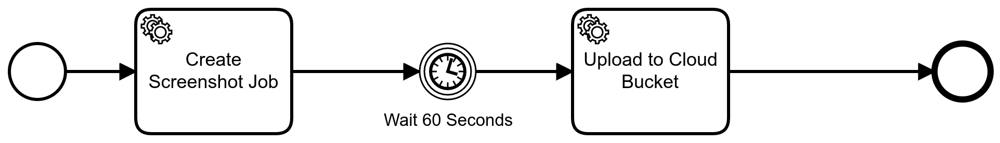

# Camunda Cloud Integration with Websiteshot

## Usage

### Environment Variables

```bash
export WEBSITESHOT_PROJECT_ID=... # Your Websiteshot Project Id
export WEBSITESHOT_API_KEY=... # Your Websiteshot API Key
export AWS_SECRET_ID=... # AWS Secret Key Id
export AWS_SECRET_KEY=... # AWS Secret Key
export AWS_BUCKET=camunda-cloud-example # AWS Bucket
export NODE_ENV=local
export CLUSTER_ID=... # Camunda Cloud Cluster Id
export CLIENT_ID=... # Camunda Cloud API Client Id
export CLIENT_SECRET=... # Camunda Cloud API Client Secret
```

### Try it out

```bash
npm i

npm run start
```

## Description

This example shows how to use Camunda Cloud as a workflow engine to generate screenshots automatically with Websiteshot.

### BPMN

This is the BPMN diagram that is executed in the process:

[](bpmn/Screenshots.bpmn)

### Example Output

```bash
[1612894914856] INFO (websiteshot-camunda-cloud-example/112614 on matrix): Connecting Zeebe Client
19:21:54.860 | zeebe |  INFO: Authenticating client with Camunda Cloud...
19:21:55.136 | zeebe |  INFO: Established encrypted connection to Camunda Cloud.
[1612894915174] INFO (websiteshot-camunda-cloud-example/112614 on matrix): Creating Zeebe Workers
[1612894965793] INFO (websiteshot-camunda-cloud-example/112614 on matrix): Creating Screenshot Job for Template Id ...
[1612895032930] INFO (websiteshot-camunda-cloud-example/112614 on matrix): name: bpmn-modeler.png
[1612895032931] INFO (websiteshot-camunda-cloud-example/112614 on matrix): name: cloud-api.png
[1612895032931] INFO (websiteshot-camunda-cloud-example/112614 on matrix): name: bpmn-models.png
[1612895032931] INFO (websiteshot-camunda-cloud-example/112614 on matrix): name: settings.png
[1612895032931] INFO (websiteshot-camunda-cloud-example/112614 on matrix): name: cluster-list.png
[1612895033192] INFO (websiteshot-camunda-cloud-example/112614 on matrix): Waiting 5sec until Screenshots have been processed
[1612895038192] INFO (websiteshot-camunda-cloud-example/112614 on matrix): Finished waiting...
[1612895038193] INFO (websiteshot-camunda-cloud-example/112614 on matrix): Uploading Screenshots to Cloud Bucket
[1612895039701] INFO (websiteshot-camunda-cloud-example/112614 on matrix): Uploaded bpmn-models.png to https://camunda-cloud-example.s3.eu-central-1.amazonaws.com/bpmn-models.png
[1612895039709] INFO (websiteshot-camunda-cloud-example/112614 on matrix): Uploaded cloud-api.png to https://camunda-cloud-example.s3.eu-central-1.amazonaws.com/cloud-api.png
[1612895039723] INFO (websiteshot-camunda-cloud-example/112614 on matrix): Uploaded settings.png to https://camunda-cloud-example.s3.eu-central-1.amazonaws.com/settings.png
[1612895039969] INFO (websiteshot-camunda-cloud-example/112614 on matrix): Uploaded bpmn-modeler.png to https://camunda-cloud-example.s3.eu-central-1.amazonaws.com/bpmn-modeler.png
[1612895040016] INFO (websiteshot-camunda-cloud-example/112614 on matrix): Uploaded cluster-list.png to https://camunda-cloud-example.s3.eu-central-1.amazonaws.com/cluster-list.png
```
